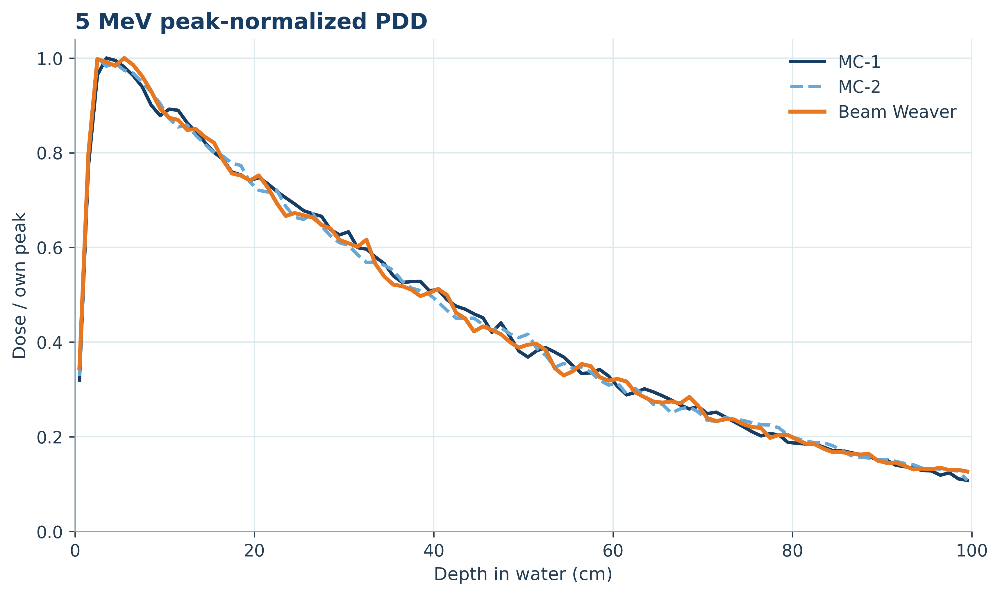

# Beam Weaver

[](https://doi.org/10.5281/zenodo.18994134)

**Beam Weaver is a learned-kernel Monte Carlo framework for photon transport in water.**

## Introduction

Beam Weaver began as a proof-of-concept neural network that could be taught how to simulate photon/electron transport. Initially, the developed architecture involved  a Soft Actor–Critic agent, but training revealed that the previously supervised physics head used to kickstart the agent already accurately reproduced the photon transport, generating complete recursive showers without the need for reinforcement updates.  This shifted the focus from a reward-driven reinforcement learning agent to a direct framework, learning the local stochastic transition kernels directly from the Monte Carlo sampling. The mathematical framework also favoured this approach[1]. After the teaching process, Beam Weaver’s photon-electron showers are generated recursively just like Monte Carlo, strictly from values inferred by the  neural network heads, while imposing deterministic physics conservation laws. Beam Weaver was trained using *Beam Spinner*, a self-developed Python Monte Carlo code for photon and electron transport in liquid water (1 keV–10 MeV), largely inspired by the PENELOPE code [2]. Beam Spinner can sample photon mean free path, Rayleigh, Compton, photoelectric and pair events, using EPDL cross-sections and tabular coherent and incoherent scattering functions [3]; and simulate electron condensed history transport using EPDL stopping power tables. 

After training, In its current form, Beam Weaver can successfully transport photons in a liquid water phantom with energies ranging from 1 keV to 10 MeV. Practically all stochastic quantities are inferred (interaction choice, photon shells in the case of photoelectric events, scattering polar and azimuth photon and electron angles, shared kinetic energy in pair production), totalling 13 inferred quantities, each with its own head, while exponential mean free path sampling and electron transport still use Beam Spinner’s classical Monte Carlo approach.

## Mathematical framework

### Factorized collision law

$$
\pi_{\Theta}(\mathbf{Z}_t\mid E_t)
=\prod_{h=1}^{13}q_{\theta_h}(Z_{t,h}\mid X_{t,h})^{m_{t,h}},
\qquad m_{t,h}\in\{0,1\},\qquad q^1=q,\ q^0=1
$$

At collision t, Beam Weaver constructs the probability of event Zₜ by multiplying the predicted probabilities inferred by the relevant heads for each quantity q. Relevant heads are activated by a binary mask mₜ,ₕ which makes each irrelevante head contribute 1 to the final value.

t - collision   •   h - head index (1–13)   •   Eₜ - photon energy before collision   •   Zₜ - complete binned event   •   Zₜ,ₕ  - head-h bin

Xₜ,ₕ - energy plus required earlier outcomes   •   q  - distribution predicted by head h   •   θₕ  - head-h parameters   •   mₜ,ₕ  - relevance switch   •   Θ  - all learned parameters

### Masked cross-entropy training

$$
\mathcal{L}(\Theta)
=\sum_{h=1}^{13}\sum_{g\in\mathcal{G}_h}
H\!\left(\widehat{\mathbf{p}}_{g,h},\mathbf{q}_{\theta_h}(\cdot\mid X_{g,h})\right),
\qquad H(\mathbf{p},\mathbf{q})
=-\sum_{k=1}^{K_h}p_k\ln q_k
=H(\mathbf{p})+D_{\mathrm{KL}}(\mathbf{p}\Vert\mathbf{q})
$$

Each active head learns Beam Spinner’s observed bin frequencies. Taking −log turns the event product into a sum; because the heads have disjoint parameters, each can be trained separately. For a fixed target, minimizing cross-entropy also minimizes KL divergence [1].

ℒ -  total loss   •   𝒢ₕ - teaching targets for head h   •   g -  condition group or event   •   k  - output-bin index (Kₕ bins)

p̂  - Beam Spinner frequencies (or one-hot target)   •   q - Beam Weaver probabilities   •   H(p,q) -  cross-entropy   •   H(p) - fixed target entropy   •   Dₖₗ - remaining mismatch

## Method

Beam Weaver contains 13 disjoint heads, 11 two-hidden-layer 64-unit SiLU MLPs, and 2 learned 36-logit azimuth vectors, totalling 155,127 trainable parameters. 

Heads:

- Interaction choice;
- Rayleigh transformed polar angle $s_R = \ln[(1−cosθ_R)/2]$;
- Rayleigh azimuth angle $\phi_R$;
- Compton normalized energy transfer $u$;
- Compton azimuth angle $\phi_C$;
- Photoelectron shell;
- Photoelectron transformed angle $\nu_{Ph} = 1−cosθ_{Ph}$;
- Photoelectron azimuth angle $\phi_{Ph}$;
- Pair production kinetic-energy share;
- Electron/positron transformed angles $\nu_{pp}^{\pm}$(2);
- Electron/positron azimuth $\phi_{pp}^{\pm}$ (2);

 Each head learns a categorical distribution; continuous variables are sampled within the selected bin and transformed back to physical quantities.

Training minimizes cross-entropy against reference samples or their empirical category distributions. The heads use photon energy and, where required, the selected shell or sampled electron/positron energy fraction. Training proceeds head by head, with validation-based stopping and restoration of the best weights when overfitting. The learned energy domain is **0.001–10 MeV**.

## Experiment

After Beam Spinner taught Beam Weaver; 50,000 monodirectional and monochromatic photon histories were generated within a 10 × 10 cm² square and transported through a 100 × 100 × 100 cm³ water phantom at five different initial energies (0.1, 1, 2, 5, and 10 MeV). Two Beam Spinner runs were performed at different PRNG seeds, and one run using Beam Weaver alone. The idea was to demonstrate the fidelity of Beam Weaver’s transport capabilities. Beam Spinner and Beam Weaver’s runs shared the mean free path Simulator and the electron/positron condensed history transport. All other quantities were inferred by Beam Weaver with only prior knowledge of the energy and direction of the source particles, generating the rest recursively. Results presented here cover all five initial photon energies. Error bars are not shown for enhanced visuals.

## Results

[Results gallery](results/README.md) presents the **v0.4.0** results at **0.1, 1, 2, 5 and 10 MeV**: 50,000 primary photons per simulation, two independent Beam Spinner runs, and one Beam Weaver run. The figures present: depth dose, Compton angle, photoelectric angle and shell selection, pair kinetic-energy sharing, and interaction fractions.




## Installation

Requires **Python 3.10 or later**. Clone the repository and install:

```bash
git clone https://github.com/PedroTelesFCUP/Beam_weaver.git
cd Beam_weaver
python -m pip install -e .
```

The base installation includes NumPy, pandas and Matplotlib. Training, learned transport and learned-head validation also require PyTorch:

```bash
python -m pip install -e '.[learn]'
```

For GPU use, install the appropriate PyTorch build for your machine. Commands accept `--device cpu`, `--device cuda:0`, or the default `--device auto`.

Start the interactive program with:

```bash
python -m beamweaver
```

The installed `beamweaver` command and `python Beam_weaver_0_4_0.py` open the same application. The launcher must remain beside the `beamweaver` package when used without installation.

| Option | Operation |
| --- | --- |
| 1 | Generate training/validation/test data |
| 2 | Train all heads or one selected head |
| 3 | Run an audited shower |
| 4 | Compare MC1, MC2 and BeamWeaver |
| 5 | Validate factors or reference samplers |
| 6 | Exit |

Each operation asks for its inputs and output directory. Help and the menu can be opened without physics tables or a checkpoint.

## Water data

The six water CSV tables are included in the repository root. Commands below use `--data-dir .` when run from that directory. For tables stored elsewhere, supply their directory instead. The program reads these filenames and columns:

| File | Columns used |
| --- | --- |
| `Final_cross_sections.csv` | `E`, `photoelectric`, `compton`, `pair_triplet` |
| `Rayleigh_cross_sections.csv` | `E`, `coh` |
| `WaterPhotoShells.csv` | `E_MeV`, `H_K_cm2g`, `O_K_cm2g`, `O_L1_cm2g`, `O_L2_cm2g`, `O_L3_cm2g` |
| `water_fq.csv` | `q`, `F_q` |
| `water_sq.csv` | `q`, `S_q` |
| `ElectronStoppingPower.csv` | `E_MeV`, `S_col_MeV_per_cm`, `S_rad_MeV_per_cm` |

Generation and validation require the first five files. A learned shower requires the first four plus stopping powers; comparison requires all six. Training reads the generated dataset and does not need the CSV tables. Synthetic tables under `tests` are regression fixtures, not water reference data. See [water-table provenance and conventions](docs/water-data.md).

## Generate and train

Commands support the same workflow as the menu. Use a new or empty output directory; omit `--output` to create a timestamped directory under `runs`.

```bash
python -m beamweaver generate --data-dir . --output runs/data
python -m beamweaver train runs/data/schema_v4_data.npz --output runs/training
```

Generation samples individual collisions at fixed photon energies, producing separate training, validation and test samples. Default sample counts are:

| Setting | Default | Count applies separately to |
| --- | ---: | --- |
| `--categorical-events` | 32,768 | Process selection and shell selection at each photon energy |
| `--continuous-events` | 8,192 | Rayleigh and Compton at each photon energy; photoelectric sampling at each photon energy **and shell** |
| `--pair-events` | 16,384 | Pair production at each photon energy above threshold |

These are separate counts, not a combined event total. `--smoke` reduces the grids and counts for execution checks. Low statistics can leave representation checks unevaluable; a smoke dataset is not sufficient evidence of physical accuracy.

Generation writes `schema_v4_data.npz`, its manifest and `schema_v4_generator_spec.json`. The NPZ contains samples, category counts, bin edges and metadata. The manifest records the actual generated data; the generator specification describes canonical rules and defaults. Reuse the NPZ across training sessions.

All-head training saves individual `v040_head_*.pt` checkpoints, a training manifest and the combined `v040_policy.pt`. Resume a matching dataset/run pair to restore completed heads and train those remaining:

```bash
python -m beamweaver train runs/data/schema_v4_data.npz --resume runs/training
```

Retrain one selected head while retaining the other heads from that policy:

```bash
python -m beamweaver train runs/data/schema_v4_data.npz --resume runs/training --factor comp_u
```

`--factor` selects a head; examples include `process`, `comp_u` and `pair_frac`. Training a single head in a new run leaves the other heads untrained. Always resume with the matching dataset and binning; checkpoint identity checks are not yet comprehensive.

## Simulate, compare and validate

```bash
python -m beamweaver run runs/training/v040_policy.pt --data-dir . --energy 1.0 --histories 500 --output runs/evaluation
python -m beamweaver compare runs/training/v040_policy.pt --data-dir . --output runs/comparison
python -m beamweaver report runs/comparison
```

An audited run saves `dose.npy`, `summary.json`, execution records and, when available, `shower3d.png` showing photon tracks from up to 40 primary histories.

Comparison runs **MC1 and MC2 with independent random streams**, then Beam Weaver. Defaults are 0.05, 0.5, 1 and 5 MeV, with 2,000 primary histories per simulation at each energy. It saves per-simulation energy-deposition arrays and `comparison.json`, including interaction fractions, elapsed time and throughput. `report` creates the comparison figures from those saved outputs.

```bash
python -m beamweaver validate runs/training/v040_policy.pt --data-dir .
python -m beamweaver validate --reference --data-dir .
```

The first command compares learned distributions with reference samples; the second checks reference angular samplers against their analytic targets. Use `python -m beamweaver <command> --help` for all available controls.

## Interpretation and limitations

The fixed phantom spans x,y = −50…50 cm and z = 0…100 cm, with a uniform 10 × 10 cm² incident photon field. Its 100 depth slabs are 1 cm thick. Arrays named `dose` contain **deposited energy in MeV**, not absorbed dose in Gy. Absolute dosimetry requires mass and source normalization. Report figures normalize each depth profile to its own maximum and compare shape.

The MC1–MC2 difference illustrates sampling variability; it is not a confidence interval. Execution auditing checks covered photon-sampler calls and energy accounting, rather than establishing physical accuracy. Electron/positron transport uses continuous slowing down and simplified bremsstrahlung; positrons use electron stopping powers and annihilate at rest. The combined pair/triplet channel uses pair-event kinematics. These approximations require assessment against a trusted transport code for the intended application.

Run regression checks with `python -m unittest discover -s tests -v`. Neural checks require PyTorch; optional checks against an original source file require that file. Tests report unavailable prerequisites as skips. See `tests/README.md` for coverage.

## Citation, history and license

The Zenodo archive for **v0.4.0** is **[10.5281/zenodo.22739031](https://doi.org/10.5281/zenodo.22739031)**. The project’s persistent, all-versions DOI is **[10.5281/zenodo.18994134](https://doi.org/10.5281/zenodo.18994134)**. Cite the specific archived version used and record its Git commit. Citation metadata for the current code is in [CITATION.cff](CITATION.cff); GitHub downloads and release notes are under [Releases](https://github.com/PedroTelesFCUP/Beam_weaver/releases). The [changelog](CHANGELOG.md) links the preserved earlier releases. The historical version DOIs identify those earlier archives, not version 0.4.0.

See [architecture](docs/architecture.md) for the module layout and [contributing](contributing.md) for development guidance.

Pedro Teles — Department of Physics and Astronomy, Faculty of Sciences, University of Porto, Portugal.

The project code is licensed under the [Apache License, Version 2.0](LICENSE). See [NOTICE](NOTICE) for notices and [LICENSE-THIRD-PARTY.md](LICENSE-THIRD-PARTY.md) for the scope of third-party licensing. External data and dependencies retain their respective terms.

## References

[1] J. S. Bridle, “Probabilistic Interpretation of Feedforward Classification Network Outputs,” *Neurocomputing* (1990). [doi:10.1007/978-3-642-76153-9_28](https://doi.org/10.1007/978-3-642-76153-9_28).

[2] F. Salvat, *PENELOPE-2018: A Code System for Monte Carlo Simulation of Electron and Photon Transport*, OECD/NEA (2019). [doi:10.1787/32da5043-en](https://doi.org/10.1787/32da5043-en).

[3] D. E. Cullen, J. H. Hubbell and L. Kissel, *EPDL97: The Evaluated Photon Data Library, ’97 Version* (1997). [doi:10.2172/295438](https://doi.org/10.2172/295438). J. H. Hubbell et al., “Atomic form factors, incoherent scattering functions, and photon scattering cross sections,” *Journal of Physical and Chemical Reference Data* **4**, 471–538 (1975). [doi:10.1063/1.555523](https://doi.org/10.1063/1.555523).

Beam Spinner’s transport and sampling scheme draws substantially on the published PENELOPE algorithms; the author gratefully acknowledges Francesc Salvat, José M. Fernández-Varea, Josep Sempau and the wider PENELOPE development team.

## AI disclosure

ChatGPT (OpenAI) and Claude (Anthropic) assisted with coding and the preparation of diagrams, figures and documentation. The author reviewed the physics, implementation, analyses and interpretations and assumes full responsibility for the final work.
