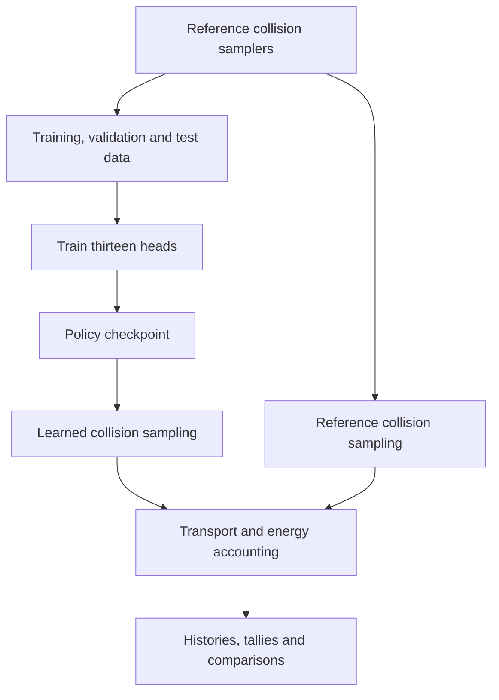

# Architecture

Beam Spinner provides reference photon-collision samples. Beam Weaver trains
thirteen disjoint categorical heads on those samples and uses them to sample
collisions during transport. Photon banks, geometry, free-flight sampling and
approximate lepton transport remain explicit simulation components.

| Module | Responsibility |
| --- | --- |
| `constants`, `materials` | Numerical definitions, category ordering and material tables |
| `physics`, `events`, `coordinates` | Reference collision sampling, event records and learned-variable transforms |
| `geometry`, `transport` | Sources, boundaries, photon banks and shared lepton transport |
| `dataset` | Collision samples, saved splits, bin edges and representation checks |
| `policy`, `training` | Head distributions, collision sampling, cross-entropy training and checkpoints |
| `audit`, `validation` | Execution provenance, energy accounting and distribution checks |
| `evaluation`, `reporting`, `cli` | Comparisons, figures, commands and the menu |

The Compton reference implementation separates
`ComptonEnergyTransferSampler.sample_energy_transfer()`, which samples energy
transfer, from `sample_compton_event()`, which constructs the outgoing photon
and recoil-electron event. Both are active and live in `physics.py`.

Heads receive energy and the shell or lepton variables required by their
factorization. Position and direction remain part of the transported particle
state. Continuous outputs use categorical bins followed by within-bin sampling
and inverse transforms. A collision invokes the heads needed for its selected
interaction.

The [development records](development) retain dated extraction and constants
checks. Historical file paths and old symbols there describe the cleanup
stages, not additional runtime implementations.
