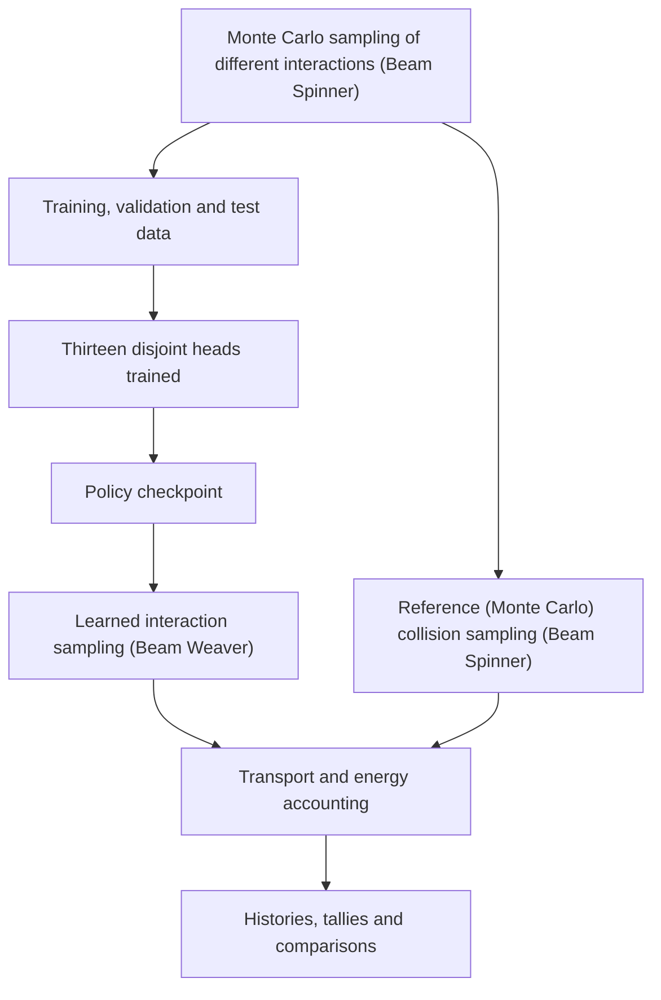

# Architecture

Beam Spinner provides reference photon-collision samples. Beam Weaver trains
thirteen disjoint categorical heads on those samples and uses them to sample
collisions during transport. Photon banks, geometry, free-flight sampling and
approximate lepton transport remain explicit simulation components.

| Module | Responsibility |
| --- | --- |
| `constants`, `materials` | Numerical definitions, category ordering and material tables |
| `physics`, `events`, `coordinates` | Monte Carlo interaction sampling (Beam Spinner), event records and learned-variable transforms |
| `geometry`, `transport` | Sources, boundaries, photon banks and shared electron/positron transport |
| `dataset` | Interaction samples, saved splits, bin edges and representation checks |
| `policy`, `training` | Head distributions, interaction sampling, cross-entropy training and checkpoints |
| `audit`, `validation` | Execution provenance, energy accounting and distribution checks |
| `evaluation`, `reporting`, `cli` | Comparisons, figures, commands and the menu |

Heads receive information on energy and the shell or lepton variables' required by their
factorization. Position and direction remain part of the transported particle
state. Continuous outputs use categorical bins followed by within-bin sampling
and inverse transforms. An interaction invokes the necessary heads.

The [development records](development) retain dated extraction and constants
checks. Historical file paths and old symbols there describe the cleanup
stages, not additional runtime implementations.
