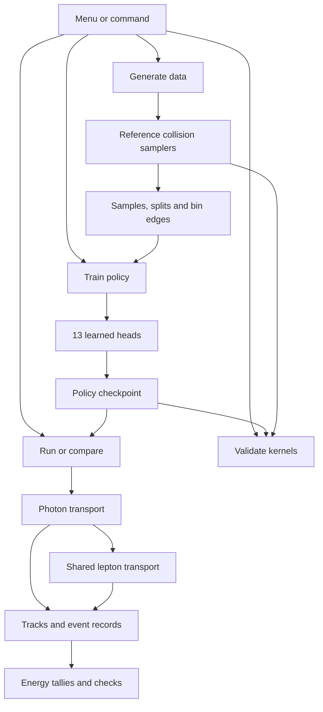
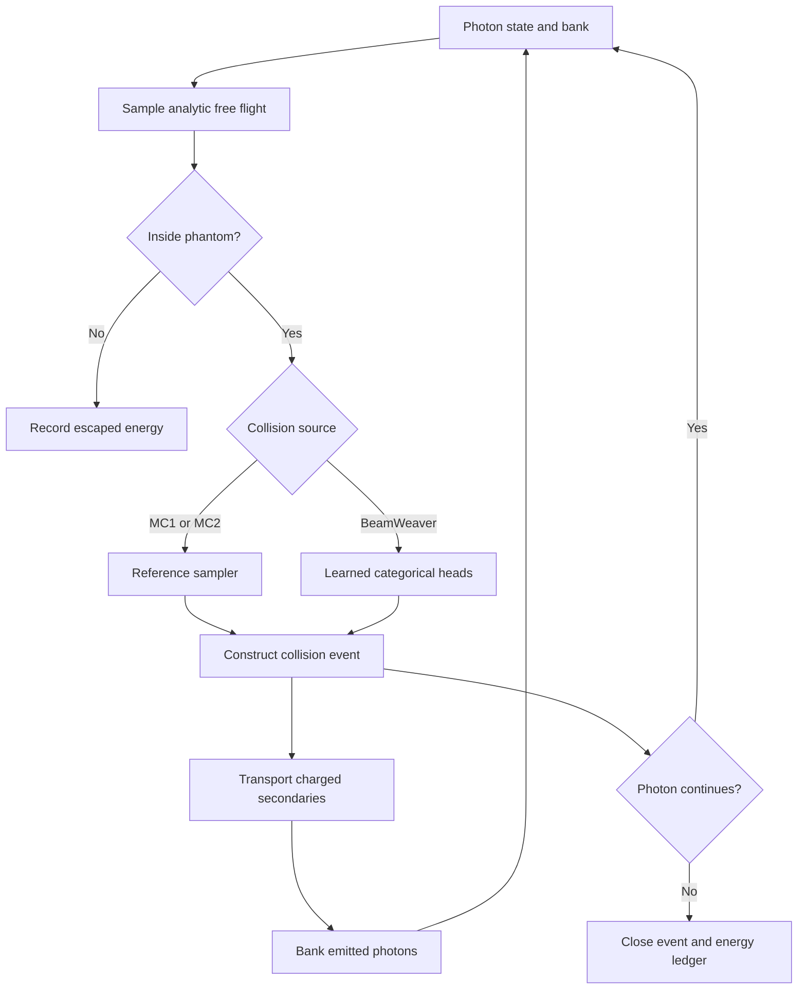

# Active Beam Weaver workflow

This map follows the supplied 0.4.0 source and the resulting package. The current application trains categorical collision kernels with cross-entropy. No reward, SAC, PPO or replay-buffer path is part of this workflow.

Generation draws collision outcomes at configured energies and shells; it is not a full shower simulation. It saves all three data splits and their interpretation. Training consumes these saved samples. The current head architecture receives energy and the required shell/lepton conditioning, rather than particle position or geometry.

## One transported collision

The diagram groups each implementation's event construction. The reference samplers construct their own events; the learned runners reconstruct them from policy outputs. Photon banks, boundary checks and the shared lepton routine remain present in both paths. Only the learned path enters the reference-sampler guard.

## Compton sampling: clear names for the two stages

| Previous name | Current name | Responsibility |
| --- | --- | --- |
| `ComptonSampler.sample()` | `ComptonEnergyTransferSampler.sample_energy_transfer()` | Draw electron kinetic energy and the outgoing photon energy ratio. |
| `sample_compton()` | `sample_compton_event()` | Construct the scattered photon and recoil-electron event. |
| `_kn_dcs()` | Removed | Unused helper. |

Both active stages now live together in `physics.py`. Data generation and reference showers use them. The learned policy uses its Compton heads and inverse transforms. The same event suffix is used for Rayleigh, photoelectric and pair collision constructors; `sample_photon_interaction()` dispatches between them.

## The former “acceptance kernels / dense rewards” section

The individual functions were still used by `preflight_validate()` to construct reference angular distributions. The reward score and the `accept_prob()` dispatcher were unused by current training.

| Previous symbol | Current validation function |
| --- | --- |
| `accept_prob_compton(...)` | `compton_angular_distribution(E_in, sampler)` |
| `accept_prob_rayleigh(...)` | `rayleigh_angular_distribution(E_in, data)` |
| `accept_prob_photo(...)` | `photo_angular_distribution(E_in, shell)` |
| `accept_prob_pair(...)` | `pair_angular_distribution(E_in)` |
| `preflight_validate(...)` | `validate_reference_samplers(...)` |

The new angular functions return the reference arrays directly. Their obsolete scalar scores and unused score arguments have been removed. Reference validation is an explicit operation, rather than a mandatory startup operation.

## Old menu to current workflow

| Previous option | Disposition |
| --- | --- |
| 1: Generate data | Keep as Generate / `generate`. |
| 2: Train complete policy | Keep as Train / `train`. |
| 3: Retrain one factor | Keep as the `train --factor` option. |
| 4: Assemble/load | Remove separate menu stage; it only loaded a checkpoint. Operations load the selected checkpoint directly. |
| 5: Local-factor validation | Keep under Validate / `validate`. |
| 6: Four-arm comparison | Remove old-model arm and checkpoint prompt. Compare MC1, MC2 and BeamWeaver. |
| 7: Single-energy evaluation | Keep as Run / `run`. |
| 8: Regenerate reports | Keep as the optional `report` command for current comparison artifacts. |
| 9: Exit | Exit in the shorter menu. |

The supplied menu already contained no executable SAC/reward option. The cleanup removes misleading descriptions and abandoned implementations; it does not claim to remove a live SAC trainer from this upload.

## Package responsibilities

| Module | Responsibility |
| --- | --- |
| `cli.py` | Menu, command arguments, selected input/output paths and lazy startup. |
| `materials.py` | Water tables and interpolation. |
| `physics.py` | Photon energy/event samplers and shared lepton transport. |
| `geometry.py` | Phantom, source reset and energy encoding. |
| `events.py` | Sampled collision event type. |
| `transport.py` | Reference MC, serial learned and batched learned showers. |
| `coordinates.py` | Learned-variable transformations and round-trip check. |
| `dataset.py` | MC factor samples, bin edges, data splits and metadata. |
| `policy.py` | Current head architecture, sampling and policy serialization. |
| `training.py` | Factor targets, cross-entropy training and explicit resume. |
| `audit.py` | Event accounting and reference-sampler guard. |
| `validation.py` | Reference angular checks and fresh-MC head validation. |
| `evaluation.py` | Audited runs and three-arm comparison. |
| `reporting.py` | Figures from current saved results. |
| `constants.py` | Current numerical values, orderings and data/model configuration. |

Serial and batched learned runners remain separate because the batched history pool changes execution scheduling. Their physical bookkeeping is preserved in this pass; consolidating it further would deserve its own controlled change.
