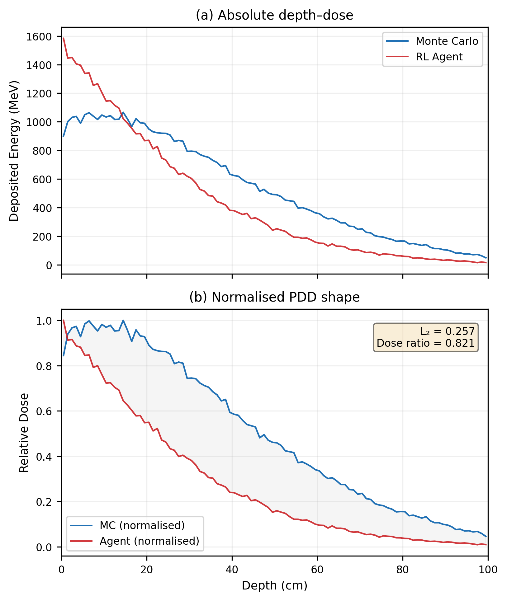

# Summary

Beam Weaver is an open-source Python framework for learning event-by-event photon transport in a homogeneous water phantom using a physics-informed hybrid Soft Actor-Critic (SAC) agent. It combines three tightly coupled components. A custom python Monte Carlo (MC) photon simulator using PENELOPE-derived cross-section tables for Rayleigh, Compton, and pair production [@penelope2018], and EPDL data for the photoelectric cross-sections [@cullen1997epdl], which can also perform condensed history transport for electrons. The second component is a Gymnasium-compatible reinforcement-learning (RL) environment that casts photon transport as a sequential decision problem, and the third consisting of a custom multi-head SAC that containes a pre-trainable physics head,  coupled with a discrete head for interaction types and and a continuous head for continuous transport quantities, like free path, scattering geometry, outgoing energy, and secondary-particle properties. Unlike standard SAC [@haarnoja2018sac], Beam Weaver uses $n$-step bootstrapped returns [@suttonbarto2018], a five-phase curriculum with scheduled teacher forcing, and physics-informed pretraining. \autoref{fig:architecture} shows the full actor-critic architecture.

# Statement of need

State-of-the-art radiation transport relies on well-established MC codes such as PENELOPE, Geant4, and EGSnrc [@penelope2018; @agostinelli2003geant4; @kawrakow2000egsnrc]. Currently, Monte Carlo techniques are pervasive in all applications where reliable dosimetry is needed, being, in many cases, the reference dosimetry calculator. This is a computational field in which reinforcement learning (RL) has not yet entered in full force. Most existing applications of machine learning to radiation transport operate downstream of the MC simulation itself: denoising low-photon MC outputs, training surrogate networks to predict final dose maps from beam parameters, or accelerating specific bottlenecks such as source modelling or plan optimization---in all cases treating the MC transport engine as a fixed black box whose outputs are to be approximated or post-processed, rather than questioning whether the event-by-event transport process can itself be learned. Parallel to this, RL libraries like Stable-Baselines3 [@raffin2021stable] provide robust algorithmic infrastructure but no radiation-physics environments, transport samplers, or validation workflows tailored to stochastic particle transport. 

Beam Weaver addresses a different question: can a reinforcement-learning agent learn to reproduce the stochastic sequence of interaction decisions that constitutes a photon history, not merely predict downstream aggregate quantities?

The agent observes photon state variables and cross-section data, then predicts the next interaction class together with continuous outcomes that can be compared against MC references process by process. This event-level formulation exploits a distinctive property of radiation transport as an RL problem: the MC simulator serves simultaneously as environment, teacher, and evaluation oracle, capable of generating an arbitrarily large and physically exact training signal at every level of detail, from individual scattering angles to aggregate depth-dose curves,making photon transport an unusually well-suited domain for reinforcement learning, where ground truth is typically expensive or unavailable. 

The current release (Beam Weaver 0.1.0) bundles the complete workflow needed to exploit this property: MC data generation, physics-head pretraining, curriculum-based SAC training, checkpointing, and evaluation through interaction statistics, secondary-particle summaries, particle tracks, physics sanity constraints and percentage depth-dose curves. It therefore provides a concrete, end-to-end answer path to the question of whether RL can learn stochastic transport, rather than merely reporting a trained model in isolation.

# State of the field

One of the most active area of application of RL techniques  is in MC acceleration through post-processing: deep learning models are trained to denoise low-photon MC dose distributions to the statistical quality of high-photon runs, achieving speedups of one to two orders of magnitude while leaving the underlying transport engine untouched. Representative work includes MCDNet for intensity-modulated radiotherapy [@peng2019mcdnet], DeepMC for MR-guided beamlet dose calculation [@neph2021deepmc], and GhostUNet for carbon-ion plan verification [@zhang2023ghostunet]. These methods treat the MC simulation as a black box and operate entirely on its scalar output (the dose map), with no representation of individual particle histories.

Another field of application is in  treatment plan optimization: selecting beam orientations, optimizing fluence maps, or tuning planning parameters. A recent comprehensive review [@wang2024drl_review] catalogues applications to IMRT, VMAT, brachytherapy, and stereotactic treatments across multiple disease sites. In these applications, the RL agent operates on clinical planning objectives (dose-volume constraints, organ-at-risk sparing) rather than on the physics of particle transport itself.

A third direction uses surrogate neural networks to predict aggregate dosimetric quantities directly from beam and geometry parameters---for example, training U-Nets or GANs on Geant4-generated dose volumes to bypass MC entirely for specific clinical geometries. NeuralRTE [@neuralrte2025] extends this idea to photon transport in turbid media for biomedical optics, learning forward light propagation through scattering tissue-like media.

In other words, none of these have attempted what Beam Weaver proposes, which is to learn the event-level transport process itself: the sequential chain of interaction type selection, scattering angle sampling, energy partitioning, and secondary particle generation that constitutes a single photon history. All existing approaches either post-process MC outputs, optimise clinical objectives that sit above the transport layer, or learn input-output mappings that skip the transport entirely. Beam Weaver occupies this gap. Rather than predicting a dose map or denoising a noisy one, it trains an RL agent to reproduce the stochastic decision sequence that a MC code executes at every interaction site---making the transport process itself the learned object.

# Software design

Beam Weaver is organised around three components, currently distributed as a single Python research script with accompanying physics tables and metadata.

**MC reference simulator.** A compact Python MC simulator samples Rayleigh, Compton, photoelectric, and pair-production interactions using PENELOPE and EPDL-derived cross sections [@penelope2018], [@cullen1997epdl], Hubbell incoherent scattering functions and coherent form factors [@hubbell1975]. Secondary electrons are handled via simplified condensed-history transport or immediate local energy deposition.

**RL environment.** A Gymnasium-compatible environment casts each photon history as an episode. Observations encode photon position, energy, direction, cross sections, and photoelectric shell context. The hybrid action space combines a discrete interaction choice with continuous outputs for free path, scattering angles, energies, and secondary kinematics. The environment exposes energy-binned interaction histograms, per-process angular distributions, secondary summaries, and depth-dose diagnostics.

**Custom SAC stack.** Built on Stable-Baselines3 [@raffin2021stable] and PyTorch [@paszke2019pytorch], the SAC stack extends standard SAC with: a multi-head policy (discrete head, continuous heads, pretrained physics branch); $n$-step replay with bootstrapped critic targets; a multitask actor loss $\mathcal{L}_{\mathrm{actor}} = \mathcal{L}_{\mathrm{SAC}} + \lambda_{\mathrm{phys}}\mathcal{L}_{\mathrm{phys}}$; and hard-coded mean free paths from tabulated cross sections (a physics prior ensuring correct attenuation by construction).

**Training pipeline.** Training proceeds in two stages (\autoref{fig:training}). Stage I pretrains the physics branch on MC-generated labels using a composite supervised loss over interaction type, energy, angles, and secondary count. Stage II is a five-phase curriculum: Phases 0--1 train the discrete head with a log-likelihood-ratio reward under decaying teacher forcing; Phases 2--3 freeze the discrete head and train the continuous heads with kernel rewards (acceptance-probability matching, per-bin KL divergence, conservation penalties) under decaying teacher forcing; Phase 4+ refines remaining heads. During teacher-forced phases, the replay buffer stores MC-overridden actions, anchoring the critic to physics-consistent data.

# Current limitations

The current release is intentionally narrow in scope: a monolithic single-script codebase, restricted to a 10 × 10 cm² monoenergetic photon beam incident perpendicularly on a homogeneous 100 × 100 × 100 cm³ water phantom. 

# Research impact statement

Beam Weaver's immediate impact is as an openly archived, reproducible baseline for research on learned photon transport. The complete experimental workflow---MC data generation, physics-head pretraining, curriculum-based RL training, checkpointing, and process-level evaluation---is publicly inspectable, lowering the barrier for researchers who want to benchmark alternative policies, reward functions, or action parameterisations without rebuilding a transport-and-training pipeline from scratch. Even in its current state, the release captures a distinctive architecture, training regime, and transport-specific evaluation strategy that would otherwise remain unavailable. The Zenodo archive and public repository make the software citable, inspectable, and reusable [@beamweaver_software].

# Physics enforcement mechanisms

The agent's action
interpretation is structurally constrained in order to ensure physical sanity (energy conservation, kinetic agreement, number of secondary particles produced) in every agent-generated event,
regardless of what the policy network outputs.

This should be seen as distinct from the soft reward signals described in
the reward design section. 

At evaluation time these constraints are switched off so in principle the agent should have been able to learn the physics by itself.

**Energy conservation.** The agent's continuous energy outputs are not
interpreted as absolute energies. Instead, they are treated as relative
weights that define a fractional partition of the available kinetic
energy. For Compton scattering, the two energy outputs (scattered
photon and recoil electron) are normalized so that
$E_\gamma^{\mathrm{out}} + E_e = E_\gamma^{\mathrm{in}}$ exactly. For
pair production, the two secondary energy outputs are similarly
normalized so that
$E_{e^-} + E_{e^+} = E_\gamma^{\mathrm{in}} - 2m_e c^2$ exactly. For
photoelectric absorption, the electron receives the full available
energy $E_e = E_\gamma^{\mathrm{in}} - E_b$ after shell-specific
binding energy subtraction, and the scattered photon energy is forced
to zero. For Rayleigh scattering (elastic), the outgoing photon energy
equals the incoming energy by construction. These fractional-split
constraints mean that the agent cannot violate energy conservation
regardless of its network outputs; it can only control *how* the
available energy is distributed among outgoing particles.

**Secondary particle multiplicity.** The number of secondary electrons
is structurally determined by the interaction type rather than freely
predicted by the agent. Rayleigh scattering produces no secondaries.
Compton scattering and photoelectric absorption each produce exactly
one electron. Pair production produces exactly two charged particles
(electron and positron). This structural masking is enforced through
a dedicated masking function which zeros out unused secondary-particle
action slots based on the discrete interaction choice. The agent
therefore cannot produce unphysical secondary counts (for example, two
electrons from a Compton event or zero electrons from photoelectric
absorption).

**Forbidden photon energy.** For photoelectric absorption and pair
production---interactions where the photon is fully absorbed---the
agent's scattered-photon energy output is overridden to zero. If the
agent's raw energy output is nonzero for these interaction types, a
hard penalty of $r_{E\text{-corr}} = -5$ is applied in addition to the
override, providing both a hard constraint and a learning signal.

**Shell-specific binding energies.** For photoelectric absorption, the
binding energy subtracted from the available kinetic energy is
determined by the specific atomic shell selected by the MC reference
sampler (H K, O K, O L1, O L2, or O L3), using shell-resolved
cross-section tables for water. The shell identity is communicated to
the agent through a one-hot observation vector, ensuring that the
energy balance accounts for the correct shell-specific Q-value.

**Pair production threshold.** The discrete head's logits for pair
production are suppressed by $-10^9$ whenever the photon energy falls
below $2m_e c^2 = 1.022$ MeV, preventing the agent from selecting a
kinematically forbidden interaction.

**Mean free path from physics.** The mean free path is not a learned
quantity in the current architecture. It is computed from the tabulated
total attenuation coefficient $\mu(E)$ and sampled from the
corresponding exponential distribution $p(s) = \mu e^{-\mu s}$, with
the $\mu$ output frozen to its physics-derived value throughout
training. This ensures that the spatial distribution of interaction
sites matches the reference transport regardless of other policy
outputs.

The remaining degrees of freedom---interaction
type selection, scattering angles, energy partition ratios, and
secondary-particle directions---are learned through the reward signal
and constitute the quantities evaluated below.

# Preliminary results

The results presented here are from a partially trained agent
evaluated at 1 MeV incident photon energy on a
$100 \times 100 \times 100$~cm$^3$ water phantom. At the time of
evaluation, the agent had completed the full discrete interaction
curriculum (Phases 0--1) and the full continuous kernel curriculum
(Phase 2), covering all 16 energy regimes from 1 keV to 1 MeV.
Phase 3 (teacher-forcing decay for continuous heads) had not yet
begun. These results should accordingly be interpreted as a progress
snapshot in which the continuous heads have seen supervised examples
across the full energy range but have not yet transitioned to
autonomous prediction.

Training was performed on a single NVIDIA RTX 3060 (12 GB VRAM)
rented through Vast.ai, using a Jupyter notebook environment with
PyTorch and CUDA 12.6. The host machine was equipped with an Intel
Xeon E5-2696 v3 processor and 64.5 GB of system memory. The full
training run through Phase 2 (100 000 timesteps across all curriculum
phases) completed in approximately 24 hours at a rental cost of
approximately \$1.27 USD. Table 1 summarises the training hardware.

**Table 1.** Training hardware and cost.

| Component       | Specification                          |
|:----------------|:---------------------------------------|
| GPU             | NVIDIA RTX 3060 (12 GB VRAM)           |
| GPU compute     | 12.2 TFLOPS (FP32)                     |
| CPU             | Intel Xeon E5-2696 v3 (18 cores)       |
| System memory   | 64.5 GB                                |
| Platform        | Vast.ai cloud rental                   |
| Rental cost     | \$0.053/hr (~\$1.27 total)             |
| Training time   | ~24 hours (Phases 0--2, 100k timesteps)|
| Software        | PyTorch, CUDA 12.6, Jupyter Notebook   |

The evaluation compared 10 000 photon histories generated by the
internal MC reference simulator against 10 000 histories generated by
the agent, both using condensed-history electron transport for
secondary energy deposition. Table 2 summarizes the key metrics.

**Table 2.** Evaluation summary at 1 MeV (10 000 photon histories).

| Metric                          |       MC |    Agent |    Ratio |
|:--------------------------------|---------:|---------:|---------:|
| Total interactions              |  137 701 |   66 562 |     0.48 |
| Mean track length (interactions)|     13.8 |      6.7 |     0.48 |
| Total dose deposited (MeV)     | 10 689.7 |  8 823.1 |    0.825 |
| Normalised PDD L₂ distance     |      --- |      --- |   0.226  |
| Compton fraction                |    0.922 |    0.886 |     0.96 |
| Rayleigh fraction               |    0.033 |    0.025 |     0.74 |
| Photoelectric fraction          |    0.044 |    0.089 |     2.00 |
| Compton mean angle (°)          |     64.7 |     53.5 |      --- |
| Rayleigh mean angle (°)         |      7.2 |     53.0 |      --- |
| Simulation time (s)             |    464.4 |    151.5 |   3.1×   |

## Interaction type selection

The discrete head reproduces the Compton-dominated interaction mixture
at 1 MeV with high accuracy: the Compton fraction is within 4% of the
MC reference. Rayleigh and photoelectric fractions show larger
deviations---Rayleigh is under-predicted by a factor of 0.74 and
photoelectric is over-predicted by a factor of 2---but these are
minority channels at 1 MeV (together accounting for less than 8% of MC
interactions) and the agent has not yet undergone angular curriculum
training at energies where these channels dominate.

## Depth--dose behaviour

\autoref{fig:interactions} shows the interaction type proportions and
track length distributions. \autoref{fig:pdd} compares the percentage
depth--dose (PDD) curves. The agent reproduces the overall exponential
attenuation profile, with good shape agreement in the first 30--40 cm
of depth. Beyond approximately 50 cm, the agent's PDD falls off more
steeply than the MC reference, resulting in a total deposited dose
that is 82.5% of the MC value. This under-deposition at depth is
consistent with the shorter mean track length (6.7 versus 13.8
interactions per photon): incorrect angular distributions cause
unphysical energy transfers that terminate photon histories
prematurely. Despite the hard energy conservation constraint, incorrect
energy *partition ratios* (driven by the uncoupled angle--energy
parameterization discussed below) lead to excessive energy transfer to
secondary electrons at individual interaction sites, reducing the
photon energy below the transport cutoff sooner than in the MC
reference.

## Angular distributions

\autoref{fig:angles} shows the scattering-angle distributions for
Rayleigh, Compton, and photoelectric interactions. Rayleigh scattering
in the MC reference is tightly forward-peaked (mean 7.2°, 95th
percentile 18.9°), as expected from the coherent form-factor weighting
at 1 MeV. The agent instead produces a broad angular distribution
(mean 53.0°) that spans the full 0--180° range. Compton scattering
shows qualitatively better agreement (MC mean 64.7° versus agent mean
53.5°), but with substantially higher variance (agent standard
deviation 61.4° versus MC 42.3°) and a spurious concentration of
events near 0°. The photoelectric electron angular distribution is
consistent between MC and agent, both showing broad distributions as
expected from the Sauter and isotropic angular models used for K-shell
and L-shell ejection respectively.

These angular discrepancies have a known cause: the current
implementation parameterizes scattering angles by mapping the policy
network's tanh-squashed output linearly to $\theta \in [0, \pi]$. The
tanh nonlinearity concentrates probability density near the midrange
($\theta \approx 90°$) and exponentially suppresses the tails, making
forward-peaked distributions structurally difficult to represent
regardless of the reward signal. A reparameterization from $\theta$ to
$\cos\theta$ is planned for the next release.

## Compton energy--angle consistency

\autoref{fig:compton_ae} examines the kinematic consistency of Compton
scattering events by plotting the scattered photon energy against
scattering angle alongside the Klein--Nishina prediction. In the MC
reference, all events lie on or near the analytic curve
$E_{\mathrm{out}} = E_{\mathrm{in}} / (1 + \alpha(1 - \cos\theta))$.
The agent's events form a diffuse cloud with weak correlation between
angle and energy.

This occurs because the current architecture independently predicts the
energy partition ratio and scattering angle for Compton events. While
energy conservation is guaranteed by the fractional-split constraint
($E_\gamma^{\mathrm{out}} + E_e = E_\gamma^{\mathrm{in}}$ exactly),
the *ratio* of that split is a free parameter that should be
deterministically related to the scattering angle through the Compton
formula. The agent's two continuous outputs (energy fraction and photon
angle) are coupled only through a soft kinematic consistency penalty
($\lambda = 0.05$) and the acceptance kernel reward. The combined
constraint is not yet sufficient to enforce the tight angle--energy
correlation required by Klein--Nishina kinematics. A fourfold increase
in the consistency penalty coefficient ($\lambda = 0.05 \to 0.20$) is
planned for the next training iteration.

## Secondary particle properties

Table 3 summarizes the secondary electron properties. As noted above,
the number of secondaries per interaction is structurally enforced:
every Compton event produces exactly one recoil electron, every
photoelectric event produces exactly one ejected electron, and every
pair production event produces one electron and one positron. The
counts in Table 3 therefore reflect the total number of each
interaction type rather than a learned multiplicity.

The Compton recoil electron count is proportional to the total number
of Compton events (agent produces 58 996 versus MC 126 993, reflecting
the shorter track lengths). The mean Compton electron energy is higher
for the agent (0.136 MeV versus 0.069 MeV), consistent with the energy
partition inconsistency discussed above: the agent sometimes assigns
excessive energy to the electron at small scattering angles, which is
kinematically forbidden under Klein--Nishina but permitted by the
current soft constraint.

For photoelectric electrons, the agent produces correct counts (5 600
O K-shell electrons versus MC 5 799, and 313 O L1-shell electrons
matching MC exactly) but substantially lower mean energies (agent
0.009 MeV versus MC 0.050 MeV for O K-shell). This discrepancy arises
because the agent has only trained through the 5--10 keV energy regime,
where photoelectric electron energies are indeed on the order of a few
keV. At the 1 MeV evaluation energy, the available energy after K-shell
binding subtraction is approximately 0.999 MeV, but the agent's energy
partition---seeded from the low-energy regime---has not yet adapted to
higher energies. This is expected to resolve as the curriculum
progresses through higher-energy regimes.

**Table 3.** Secondary electron statistics.

| Label       | MC count | MC mean E (MeV) | Agent count | Agent mean E (MeV) |
|:------------|--------:|-----------------:|------------:|-------------------:|
| compton\_e  | 126 993 |           0.069  |      58 996 |             0.136  |
| photo\_O\_K |   5 799 |           0.050  |       5 600 |             0.009  |
| photo\_O\_L1|     313 |           0.051  |         313 |             0.009  |

## Free path distributions

Free path distributions for Compton scattering agree well between MC
and agent (MC mean 7.6 cm, agent mean 8.8 cm). As noted above, the
mean free path is computed from the tabulated attenuation coefficient
rather than learned, so this agreement reflects the physics
initialization rather than training convergence. Photoelectric free
paths are shorter for the agent (1.6 cm versus 4.0 cm), consistent
with the over-representation of photoelectric events at energies where
Compton should dominate.

## Spatial fluence

\autoref{fig:fluence} shows the XZ fluence maps for MC and agent
showers. Both exhibit the expected forward-peaked pencil-beam structure
with lateral scatter increasing with depth. The agent's fluence is
truncated at shallower depths, consistent with the shorter track
lengths and steeper PDD falloff discussed above. The lateral spread at
matched depths is qualitatively similar, suggesting that the overall
transport geometry is reasonable even though the per-event angular
distributions are not yet converged.

## Computational performance

The agent generated 10 000 photon histories in 151.5 seconds compared
to 464.4 seconds for the MC reference, a speedup of approximately
3.1×. This comparison should be interpreted with caution. 
The speedup is reported here only to establish that the
agent's inference cost is in the same order as the reference, not to
claim a definitive performance advantage.

## Identified improvements for the next release

The evaluation identifies four concrete improvements planned for the
immediate next training iteration:

1. **Angle reparameterization.** The continuous action slots for polar
   angles will be changed from $\theta \in [0, \pi]$ to
   $\cos\theta \in [-1, 1]$. This places the bulk of physical
   scattering distributions (Klein--Nishina, Rayleigh form factor,
   Sauter) in the linear region of the tanh activation, where gradient
   flow is strongest, and eliminates the structural suppression of
   forward-peaked and backward-peaked angular distributions.

2. **Stronger kinematic consistency.** The Compton electron consistency
   penalty coefficient will be increased from $\lambda = 0.05$ to
   $\lambda = 0.20$ to enforce tighter coupling between the predicted
   photon angle and the implied recoil electron kinematics.

3. **Energy regime truncation.** Episodes will be terminated when the
   photon energy drops below the current curriculum regime floor during
   Phase 2 training. This prevents out-of-regime transitions---where
   the continuous head is untrained---from entering the replay buffer
   and contaminating the critic's value estimates for energy ranges
   that will be covered by later curriculum stages.

4. **Feature extractor freezing.** The shared feature extractor will be
   frozen during Phase 2 and beyond to prevent representation drift
   from degrading the pretrained physics heads. Training diagnostics
   show that physics head losses increase during Phase 2 as the RL
   actor loss reshapes the shared feature representation away from the
   physics-optimal configuration established during pretraining.

# AI usage disclosure

Generative AI tools (OpenAI ChatGPT and Anthropic Claude) were used to assist with code development, debugging, and manuscript preparation, including the architecture diagrams in this paper. The human authors defined the research question, designed all physics models and reward structures, made all architectural decisions, validated all code against known references, and remain fully responsible for the final submission.

# Acknowledgements

Beam Weaver builds on PENELOPE for transport methodology [@penelope2018], Geant4 for design inspiration [@agostinelli2003geant4], Stable-Baselines3 for RL infrastructure [@raffin2021stable], and PyTorch [@paszke2019pytorch]. It also draws on the RL literature on multi-step bootstrapping and entropy-regularised policy optimisation [@suttonbarto2018; @haarnoja2018sac], and on Hubbell and co-workers for atomic form factors and incoherent scattering functions [@hubbell1975].

# References
