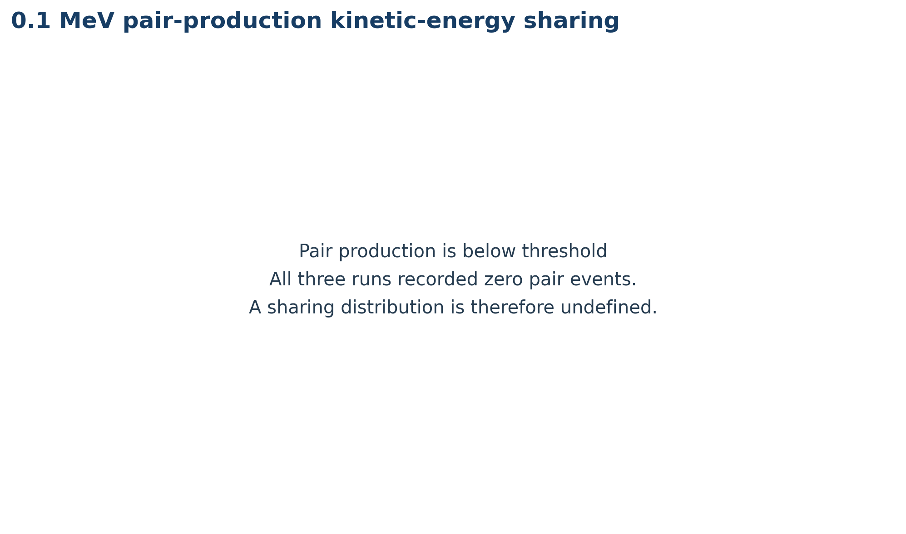
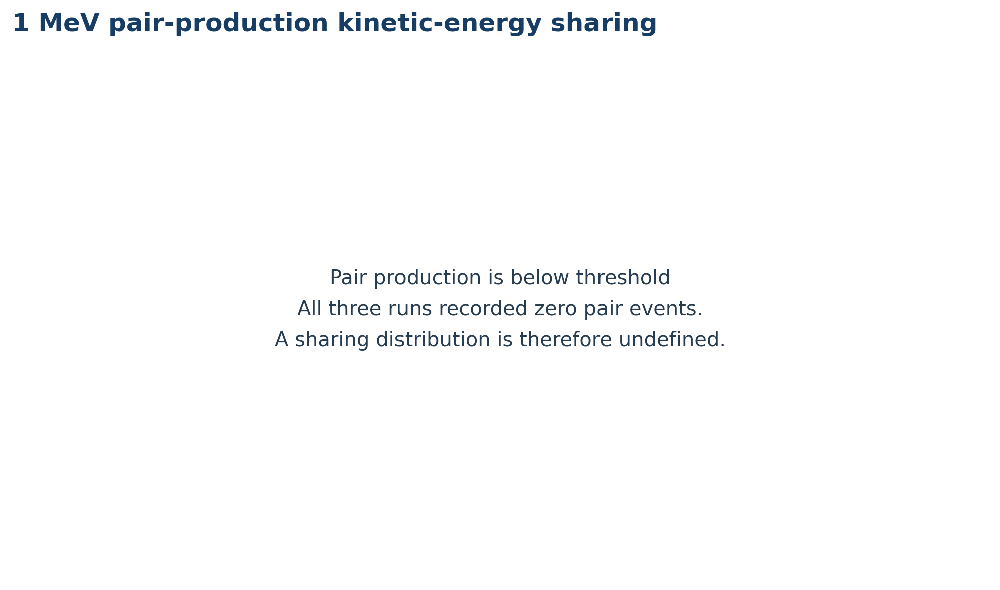
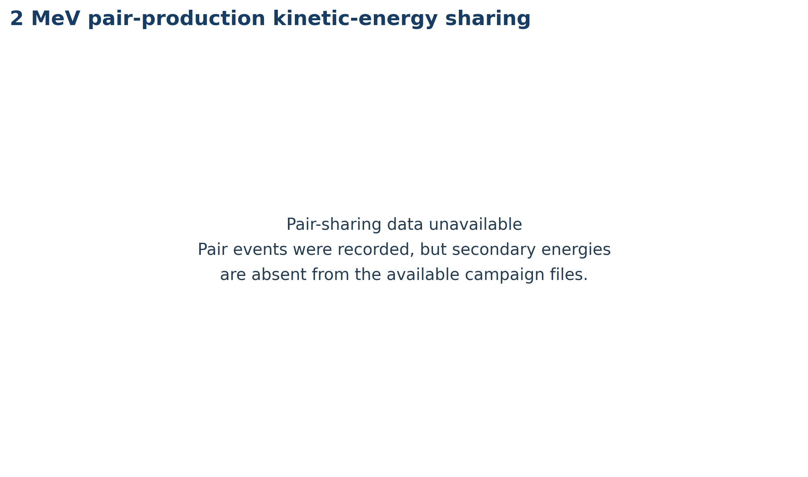
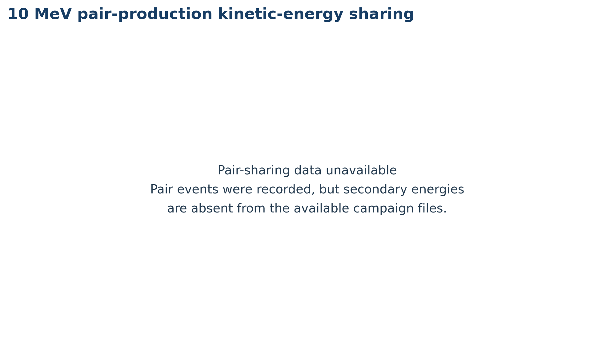

# ECMP results — all five photon energies

[Back to the project README](../README.md)

## Experiment

After Beam Spinner taught Beam Weaver; 50,000 monodirectional and monochromatic photon histories were generated within a 10x10 cm2 square and transported through a 100x100x100 cm3  water phantom at five different initial energies (0.1, 1, 2, 5, and 10 MeV). Two Beam Spinner runs were performed at different PRNG seeds, and one run using Beam Weaver alone. The idea was to demonstrate the fidelity of Beam Weaver’s transport capabilities. Beam Spinner and Beam Weaver’s runs shared the mean free path Simulator and the electron/positron condensed history transport. All other quantities were inferred by Beam Weaver with only prior knowledge of the energy and direction of the source particles, generating the rest recursively. Results presented here cover all five initial photon energies. Error bars are not shown for enhanced visuals.


## Figure coverage

Every energy below has the same five figure slots. 

| Initial energy | PDD | Compton polar angle | Photoelectric polar angle / shell selection | Pair kinetic-energy sharing | Interaction fractions |
| --- | --- | --- | --- | --- | --- |
| [0.1 MeV](#01-mev) | All three runs | MC1 + Beam Weaver | Angle: MC1 + Beam Weaver; shells: MC1 + Beam Weaver (MC2 unavailable) | No pair events; below threshold | All three runs |
| [1 MeV](#1-mev) | All three runs | MC1 + Beam Weaver | Angle: MC1 + Beam Weaver; shells unavailable | No pair events; below threshold | All three runs |
| [2 MeV](#2-mev) | All three runs | MC1 + Beam Weaver | Angle: MC1 + Beam Weaver; shells unavailable | Unavailable | All three runs |
| [5 MeV](#5-mev) | All three runs | MC1 + Beam Weaver | Angle: MC1 + Beam Weaver; shells: all three runs | All three runs | All three runs |
| [10 MeV](#10-mev) | All three runs | MC1 + Beam Weaver | Angle: MC1 + Beam Weaver; shells unavailable | Unavailable | All three runs |

MC2 angular histograms were not saved at any energy, including the poster’s 5 MeV example. The 0.1 and 1 MeV pair panels explicitly show that pair production is below threshold; no artificial zero-valued probability distribution is drawn. Completing the other shell and pair-sharing panels requires the original secondary records for MC1, MC2 and Beam Weaver at 1, 2 and 10 MeV, plus MC2 at 0.1 MeV.

## Reading the plots

- **Navy:** Beam Spinner MC1. **Blue:** independent MC2 (dashed where curves are used). **Orange:** Beam Weaver.
- **PDD:** each deposited-energy profile is divided by its own maximum. The 100 bins are 1 cm deep. Raw arrays contain deposited energy in MeV, not absorbed dose in Gy.
- **Angles:** probabilities in eighteen 10° bins, accumulated over collisions throughout each recursive shower. The energy label identifies the primary photon, not every individual collision energy. The saved ASCII probabilities are rounded and preserved in the numeric data; each displayed histogram is normalized to sum one, matching the poster. Reported KS statistics come from the saved summaries.
- **Shell selection:** fractions of recorded photoelectron tags in H-K, O-K, O-L1, O-L2 and O-L3; the horizontal axis is logarithmic. Shell order matches the poster.
- **Pair sharing:** thirty equal bins of electron kinetic fraction, $f=T_-/(T_-+T_+)$. Adjacent electron and positron secondary records are matched from the same pair event.
- **Interaction fractions:** fractions of recorded events throughout the recursive shower, with a separate enlarged pair-production panel. They are not cross-section ratios at the primary energy alone.

Error bars are omitted as in the poster. MC1–MC2 differences illustrate finite-sampling variability and are not confidence intervals. The two reference runs and Beam Weaver share photon free-flight sampling and approximate electron/positron transport.

## Recorded execution times

These are wall-clock times in seconds from the saved campaign. Hardware information was not recorded. Beam Weaver took longer than either reference run at every energy in these particular measurements.

| Energy (MeV) | MC1 (s) | MC2 (s) | Beam Weaver (s) |
| ---: | ---: | ---: | ---: |
| 0.1 | 26.84 | 26.22 | 285.13 |
| 1 | 175.09 | 175.86 | 644.25 |
| 2 | 414.80 | 413.81 | 979.50 |
| 5 | 1090.10 | 1097.00 | 1919.30 |
| 10 | 2160.10 | 2153.90 | 3651.90 |

## 0.1 MeV

### Peak-normalized depth dose


### Compton polar angle


### Photoelectric polar angle and shell selection


### Pair kinetic-energy sharing



### Interaction fractions


## 1 MeV

### Peak-normalized depth dose


### Compton polar angle


### Photoelectric polar angle and shell selection


### Pair kinetic-energy sharing



### Interaction fractions


## 2 MeV

### Peak-normalized depth dose


### Compton polar angle


### Photoelectric polar angle and shell selection


### Pair kinetic-energy sharing



### Interaction fractions


## 5 MeV

### Peak-normalized depth dose


[Original vector PDF](figures/5MeV/pdd.pdf)

### Compton polar angle


[Original vector PDF](figures/5MeV/compton_angle.pdf)

### Photoelectric polar angle and shell selection


[Original vector PDF](figures/5MeV/photoelectric_angle_shell.pdf)

### Pair kinetic-energy sharing


[Original vector PDF](figures/5MeV/pair_share.pdf)

### Interaction fractions


[Original vector PDF](figures/5MeV/interaction_fractions.pdf)


## 10 MeV

### Peak-normalized depth dose


### Compton polar angle


### Photoelectric polar angle and shell selection


### Pair kinetic-energy sharing



### Interaction fractions


## Data and reproduction

The compact [campaign data](data/campaign.json) contains the numeric dose arrays, angular probabilities, shell counts, pair-sharing histogram counts, timing and original run identifiers used here. Each source file is identified by its name, energy, byte size and SHA-256 hash. The [poster figure manifest](data/poster_figures.json) records the exact original PNG/PDF hashes and attachment provenance. The [numeric verification record](data/poster_numeric_verification.json) compares the saved data with the original poster’s vector curves.

From the repository root, with NumPy and Matplotlib installed:

```bash
python scripts/plot_results.py
```

The plotter regenerates the figures from these compact numeric inputs and preserves the five original 5 MeV poster PNGs. See `python scripts/plot_results.py --help` for a separate output directory and for regenerating a comparison set for the poster energy. No checkpoint or simulation is needed for plotting. Large original pickle archives are not needed or loaded by this plotter.

The saved source folder was `BeamWeaver_latest_0_2_9`, with energy subdirectories `0p1MeV`, `1MeV`, `2MeV`, `5MeV` and `10MeV`. Metadata JSON is available for the first four energies; the 10 MeV ASCII summary and dose arrays are available, but its metadata JSON and secondary records were not present. Secondary records were available only for MC1 and Beam Weaver at 0.1 MeV and for all three runs at 5 MeV.
